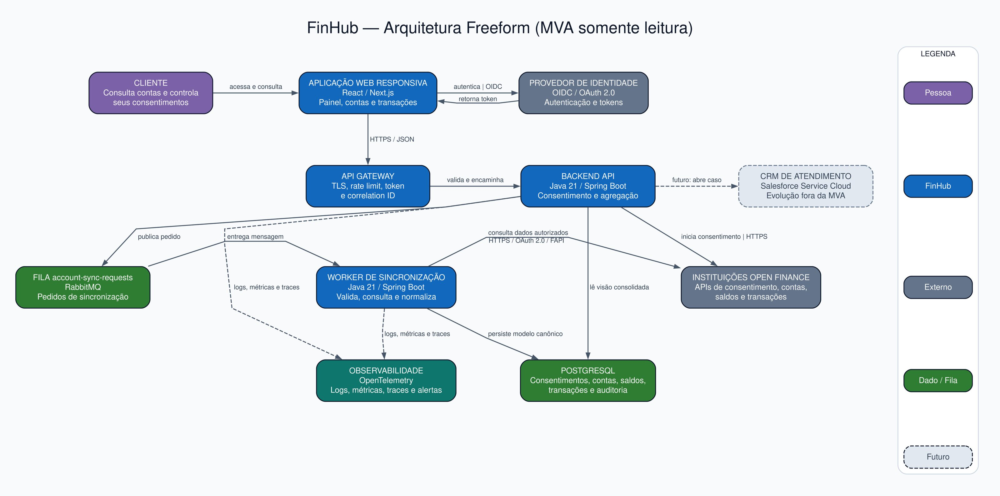
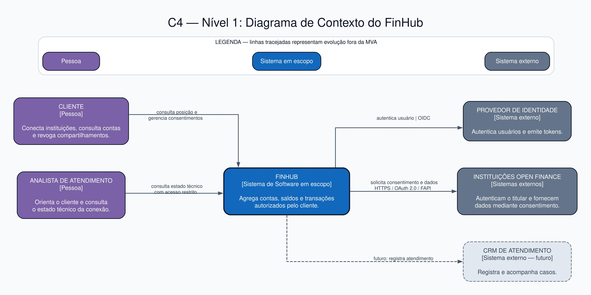
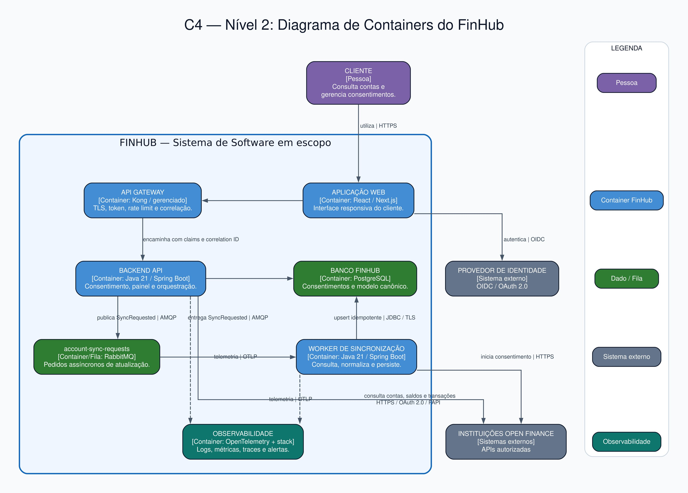
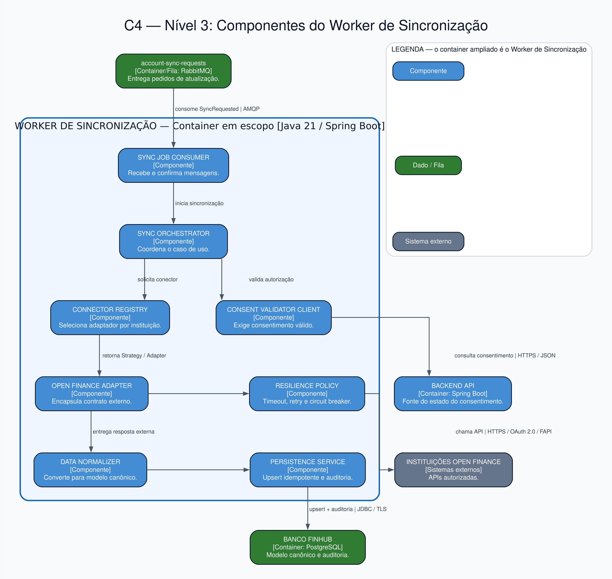

# FinHub — Agregador de Contas via Open Finance

> Projeto acadêmico da disciplina **IT Architecture Design & Styles** — FIAP
> Versão 1.0 — Agosto/2026

## Integrantes

| Integrante | RM |
|---|---|
| Douglas Gonçalves Carvalho | 367219 |
| `[Nome do integrante]` | `[RM]` |
| `[Nome do integrante]` | `[RM]` |
| `[Nome do integrante]` | `[RM]` |
| `[Nome do integrante]` | `[RM]` |
| `[Nome do integrante]` | `[RM]` |

## 1. Resumo executivo

O **FinHub** é um agregador de contas que permite ao cliente visualizar, em um único lugar, contas, saldos e transações mantidos em diferentes bancos e fintechs. O compartilhamento ocorre somente após consentimento do titular e utiliza as APIs padronizadas do Open Finance Brasil.

A primeira versão é uma **Arquitetura Mínima Viável (MVA) somente para consulta**. Pagamentos, transferências, iniciação de transação e recomendação financeira automatizada não fazem parte desta versão. Essa restrição reduz o risco regulatório, de segurança e de escopo enquanto o grupo valida a utilidade da solução e a viabilidade de integração.

## 2. Storytelling — o problema que resolvemos

### 2.1 Situação atual

Marina possui conta em um banco tradicional, uma conta digital e um cartão emitido por outra fintech. Para descobrir quanto tem disponível e entender os gastos do mês, ela precisa abrir três aplicativos, repetir autenticações e organizar as informações manualmente.

Além do esforço, os dados aparecem com nomes, formatos e datas diferentes. Isso dificulta responder perguntas simples: **quanto dinheiro tenho, onde estou gastando e qual conta está desatualizada?**

### 2.2 Conflito

Aplicativos isolados oferecem uma visão fragmentada. Planilhas exigem manutenção manual e ficam rapidamente desatualizadas. Ao mesmo tempo, uma solução financeira centralizada precisa tratar consentimento, privacidade, segurança, disponibilidade das instituições e divergências entre dados.

### 2.3 Solução proposta

Marina acessa o FinHub, autentica-se e escolhe uma instituição para conectar. O FinHub inicia a jornada de consentimento. Depois da autenticação e confirmação na instituição transmissora, os dados autorizados são sincronizados, normalizados e exibidos em um painel consolidado.

Marina pode consultar quais instituições estão conectadas, quando ocorreu a última atualização e revogar um consentimento. Se uma instituição estiver temporariamente indisponível, o painel preserva a última informação válida e deixa explícito o horário da atualização.

### 2.4 Resultado esperado

O cliente reduz o esforço para acompanhar sua vida financeira e passa a ter uma visão simples, rastreável e consentida de suas contas. Para o negócio, a MVA permite validar valor para o usuário antes de assumir o risco de funções transacionais.

## 3. Escopo da MVA

### Incluído

- Cadastro e autenticação do usuário;
- Início e acompanhamento da jornada de consentimento;
- Conexão com instituições por sandbox ou instituição parceira autorizada;
- Consulta de contas, saldos e transações autorizadas;
- Normalização e consolidação dos dados;
- Sincronização assíncrona;
- Exibição do horário e do estado da última atualização;
- Revogação do compartilhamento;
- Logs, métricas, traces e correlação técnica.

### Fora do escopo

- PIX, pagamentos, transferências ou qualquer iniciação de transação;
- Concessão de crédito e recomendação financeira automatizada;
- Armazenamento de senha bancária;
- Integração direta em produção sem os requisitos regulatórios e operacionais aplicáveis;
- Aplicativo móvel nativo — a MVA utiliza uma aplicação web responsiva;
- CRM de atendimento — indicado no Freeform como evolução futura.

## 4. O que esperamos aprender

1. Como implementar uma jornada de consentimento clara, segura e revogável.
2. Como uma solução receptora acessa o ecossistema Open Finance em sandbox e em produção.
3. Como normalizar contas, saldos e transações de instituições diferentes.
4. Qual estratégia de sincronização equilibra atualização, custo, limites e disponibilidade.
5. Como preservar a experiência quando uma API externa apresenta lentidão ou falha.
6. Quais dados realmente geram valor para o cliente em um painel consolidado.
7. Quais evidências de segurança, privacidade e rastreabilidade são necessárias antes de produção.

## 5. Perguntas que precisam ser respondidas

| ID | Pergunta | Por que importa? |
|---|---|---|
| P01 | O FinHub poderá ser participante direto ou precisará de uma instituição parceira? | Define viabilidade, prazo, custo e responsabilidades regulatórias. |
| P02 | Como será a jornada completa de consentimento, autenticação, confirmação e retorno? | É o caminho crítico de acesso aos dados. |
| P03 | Quais APIs e permissões são suficientes para a MVA? | Evita coleta excessiva e reduz o escopo. |
| P04 | Qual deve ser a frequência de atualização? | Afeta experiência, custo, limites e carga. |
| P05 | Como identificar duplicidade e divergência entre transações? | Garante confiança na visão consolidada. |
| P06 | Quanto tempo o painel pode levar para responder? | Define cache, consultas e metas de desempenho. |
| P07 | O que o usuário deve ver quando uma instituição estiver indisponível? | Evita que dado antigo pareça atual. |
| P08 | Como revogação e expiração serão refletidas internamente? | Impede uso de dados sem autorização válida. |
| P09 | Quais dados devem ser criptografados, mascarados, retidos ou excluídos? | Atende segurança, privacidade e minimização. |
| P10 | O painel consolidado realmente reduz esforço para o usuário? | Valida a proposta de valor antes de expandir o produto. |

## 6. Plano de aprendizado

| Pergunta | Hipótese inicial | Ação de aprendizado | Evidência/critério de saída |
|---|---|---|---|
| P01 | A MVA começará em sandbox ou por parceiro autorizado. | Mapear onboarding oficial e entrevistar compliance/parceiro. | Caminho documentado, responsável identificado e impedimentos registrados. |
| P02 e P08 | Consentimento será tratado como entidade com estado e validade. | Prototipar a jornada ponta a ponta no sandbox. | Criar, consultar, expirar e revogar consentimento com trilha de auditoria. |
| P03 | Contas, saldos e transações bastam para validar valor. | Revisar contratos das APIs e criar mapa de permissões. | Nenhuma permissão sem funcionalidade associada. |
| P04 e P07 | Atualização assíncrona com dado marcado pelo horário é suficiente. | Testar sincronização sob latência, erro 429 e indisponibilidade. | Painel continua utilizável e não apresenta dado antigo como atual. |
| P05 | Um modelo canônico e chaves idempotentes reduzem duplicidade. | Executar testes de contrato com respostas de instituições distintas. | Mesmo evento processado duas vezes não duplica conta ou transação. |
| P06 | Respostas consolidadas podem atingir p95 de até 2 segundos. | Fazer teste de carga com massa sintética. | p95 ≤ 2 s para consulta do painel, sem chamada síncrona ao banco. |
| P09 | Minimização, criptografia e retenção definida reduzem exposição. | Fazer threat modeling e revisão com segurança/DPO. | Sem risco crítico aberto antes de piloto controlado. |
| P10 | Usuários entendem o painel e concluem a consulta rapidamente. | Teste de usabilidade com protótipo e cinco tarefas orientadas. | Pelo menos 80% das tarefas concluídas sem ajuda. |

## 7. Principais riscos e plano de redução

| ID | Risco | Prob. | Impacto | Redução/mitigação | Indicador de controle |
|---|---|---:|---:|---|---|
| R01 | Acesso indevido ou vazamento de dados financeiros | Média | Crítico | OIDC/OAuth 2.0, menor privilégio, criptografia, gestão de segredos, mascaramento e testes de segurança. | Nenhuma vulnerabilidade crítica aberta. |
| R02 | Impossibilidade de acessar produção como receptor | Alta | Alto | Validar cedo participação, certificações e parceria; desenvolver primeiro em sandbox. | Caminho regulatório aprovado ou parceiro definido. |
| R03 | Instituição externa indisponível ou lenta | Alta | Médio | Processamento assíncrono, timeout, retry com backoff, circuit breaker, fila de erro e dado com timestamp. | Taxa de sucesso e idade do último dado visíveis. |
| R04 | Consentimento revogado ou expirado continuar sendo usado | Média | Alto | Validar estado antes da sincronização, consumir atualizações e interromper novos acessos. | Zero sincronização sem consentimento válido. |
| R05 | Duplicidade, perda ou inconsistência de transações | Média | Alto | Modelo canônico, idempotência, reconciliação e testes de contrato. | Divergências abaixo do limite acordado e reconciliadas. |
| R06 | Coleta ou retenção incompatível com o objetivo | Média | Alto | Minimização, classificação, política de retenção e revisão do DPO. | Inventário de dados e prazo de retenção aprovados. |
| R07 | Arquitetura excessiva atrasar a validação | Média | Médio | Backend modular, apenas um worker e escopo somente leitura. | Entregas pequenas e ausência de serviço sem caso de uso. |
| R08 | Falta de rastreabilidade durante incidentes | Média | Alto | Correlation ID, logs estruturados, métricas, traces, alertas e runbooks. | Requisição rastreável do gateway ao conector. |
| R09 | Usuário interpretar dado antigo como atual | Média | Alto | Exibir estado e horário da sincronização; não esconder falhas. | Toda conta apresenta `última atualização`. |

### Plano de redução em ordem

1. **Antes do desenvolvimento:** validar R02 e realizar threat modeling inicial de R01/R06.
2. **Durante a prova de conceito:** validar consentimento, revogação, contratos e idempotência.
3. **Antes do piloto:** executar testes de segurança, resiliência, carga e recuperação.
4. **Durante o piloto:** monitorar sucesso de sincronização, idade do dado, erros e percepção dos usuários.
5. **Antes de produção:** revisão formal de segurança, privacidade, operação e go/no-go.

## 8. Partes interessadas

| Parte interessada | O que espera ganhar | Responsabilidade/interesse |
|---|---|---|
| Cliente titular dos dados | Visão única, controle e menos esforço | Autoriza e revoga o compartilhamento. |
| Patrocinador/Product Owner | Evidência de valor e viabilidade | Prioriza escopo e métricas de sucesso. |
| Instituição parceira/participante | Integração segura e aderente aos padrões | Viabiliza acesso ao ecossistema. |
| Segurança da Informação | Redução de exposição e resposta a incidentes | Define controles e aprova riscos. |
| Jurídico, Compliance e DPO | Finalidade, transparência e privacidade | Avaliam participação, LGPD e retenção. |
| Engenharia e Arquitetura | Solução sustentável e evolutiva | Constroem e mantêm o sistema. |
| SRE/Operações | Diagnóstico, disponibilidade e recuperação | Monitora e opera a plataforma. |
| Atendimento | Contexto para orientar o cliente | Trata dúvidas e falhas de conexão. |
| Professor e banca | Clareza de raciocínio e decisões justificadas | Avaliam o trabalho e os diagramas. |

## 9. Usuários e objetivos

### Usuário primário — cliente titular

**Objetivos:** conectar instituições, consultar posição consolidada, entender a atualização dos dados e revogar o compartilhamento.

**Tarefa principal:** “Quero descobrir rapidamente quanto possuo e consultar minhas transações sem abrir vários aplicativos.”

### Usuário secundário — analista de atendimento

**Objetivos:** identificar o estado de uma conexão, orientar o cliente e registrar um atendimento sem visualizar informações além do necessário.

### Usuário operacional — equipe SRE/suporte técnico

**Objetivos:** detectar falhas de sincronização, localizar a origem do erro e recuperar o serviço com evidências técnicas.

## 10. Qual é o pior que pode acontecer?

O pior cenário é o FinHub permitir acesso indevido a dados financeiros ou continuar consultando uma instituição depois da revogação do consentimento. Isso causaria dano ao cliente, incidente de privacidade, perda de confiança e consequências regulatórias.

Outros cenários graves são apresentar saldos incorretos como atuais, perder rastreabilidade de uma sincronização ou entrar em produção sem um caminho válido de participação no ecossistema. Por isso, consentimento, segurança, qualidade do dado e viabilidade regulatória são critérios de bloqueio, e não itens opcionais.

## 11. Arquitetura Freeform — versão inicial



A arquitetura inicial mostra a jornada completa: acesso do cliente, autenticação, consentimento, consulta ao painel, solicitação assíncrona de sincronização, conexão com as APIs das instituições, persistência e observabilidade. O CRM aparece tracejado como evolução, fora da MVA.

## 12. Descrição dos componentes

| Componente | Responsabilidade | Tecnologia sugerida | Decisão relevante |
|---|---|---|---|
| Aplicação Web Responsiva | Interface do cliente, consentimentos, contas e transações | React/Next.js | Um único frontend reduz o custo da MVA. |
| API Gateway | Entrada única, TLS, rate limit, validação de token e correlação | Kong ou serviço gerenciado equivalente | O frontend não acessa serviços internos diretamente. |
| Provedor de Identidade | Autenticação e emissão de tokens OIDC | Provedor OIDC gerenciado | Senhas não são tratadas pelo backend de negócio. |
| Backend API | Regras da MVA, painel consolidado e orquestração | Java 21 + Spring Boot | Monólito modular evita microserviços prematuros. |
| Módulo de Consentimento | Estado, validade, permissões e revogação | Módulo do Backend API | Consentimento é domínio central, não um campo isolado. |
| Módulo de Agregação | Constrói a visão consolidada | Módulo do Backend API | Lê dados persistidos; não chama bancos durante a consulta do painel. |
| Fila `account-sync-requests` | Desacopla pedido e execução da sincronização | RabbitMQ | Permite retry, controle de carga e absorção de falhas. |
| Worker de Sincronização | Consome pedidos, valida consentimento e consulta instituições | Java 21 + Spring Boot | Processamento idempotente e resiliente. |
| Adaptadores Open Finance | Encapsulam contratos externos e normalizam respostas | Ports & Adapters | Protegem o domínio de mudanças externas. |
| Banco de Dados | Usuários, consentimentos, contas, saldos, transações e auditoria | PostgreSQL | Dados cifrados e segregados por titular. |
| Observabilidade | Logs, métricas, traces, dashboards e alertas | OpenTelemetry + stack gerenciada | Toda jornada usa um identificador de correlação. |
| APIs Open Finance | Fornecem dados autorizados das instituições | HTTPS + OAuth 2.0/FAPI | Dependência externa e sujeita a requisitos de participação. |
| CRM de Atendimento | Registro e acompanhamento de casos | Salesforce Service Cloud | Evolução futura; não pertence à MVA. |

## 13. Requisitos importantes

### Requisitos funcionais

| ID | Requisito | Critério de aceitação | Por que é importante? |
|---|---|---|---|
| RF01 | O usuário deve autenticar-se antes de acessar qualquer dado. | Requisições sem token válido recebem acesso negado. | Protege dados financeiros. |
| RF02 | O usuário deve iniciar e acompanhar consentimentos por instituição. | Estado, permissões, criação e validade ficam visíveis. | O acesso depende de autorização explícita. |
| RF03 | O sistema deve consolidar contas e saldos autorizados. | Painel identifica instituição, conta, saldo e atualização. | Entrega a proposta de valor principal. |
| RF04 | O sistema deve listar transações com período e instituição. | Consulta filtra e pagina resultados sem duplicidade. | Facilita análise sem sobrecarregar a interface. |
| RF05 | O usuário deve solicitar atualização dos dados. | Pedido entra na fila e o estado passa por solicitado, em processamento, concluído ou falho. | Evita dependência síncrona das instituições. |
| RF06 | O usuário deve revogar um compartilhamento. | Novas sincronizações são bloqueadas após a revogação. | Garante controle contínuo do titular. |
| RF07 | O sistema deve mostrar falha e horário da última atualização. | Dado antigo nunca aparece sem timestamp e estado. | Evita interpretação incorreta. |

### Requisitos não funcionais

| ID | Requisito | Meta inicial | Por que é importante? |
|---|---|---|---|
| RNF01 | Segurança | TLS em trânsito, criptografia em repouso, menor privilégio, segredos fora do código e proteção OWASP. | A natureza do dado exige defesa em profundidade. |
| RNF02 | Privacidade | Coletar apenas dados associados a finalidade e consentimento; aplicar retenção e exclusão. | Reduz exposição e apoia LGPD. |
| RNF03 | Desempenho | p95 ≤ 2 s no painel consolidado, usando dados já sincronizados. | Mantém boa experiência sem depender de terceiros. |
| RNF04 | Disponibilidade | Meta de 99,5% na MVA e degradação controlada de integrações. | Falha de um banco não deve derrubar todo o painel. |
| RNF05 | Resiliência | Timeout, retry com backoff, circuit breaker, idempotência e fila de erro. | APIs externas podem oscilar ou limitar chamadas. |
| RNF06 | Observabilidade | 100% das sincronizações com correlation ID, métricas, logs e trace. | Permite diagnóstico e auditoria. |
| RNF07 | Acessibilidade | Fluxos principais operáveis por teclado e com contraste adequado, seguindo WCAG 2.1 AA como referência. | Evita excluir usuários e melhora usabilidade. |

## 14. Diagramas C4

O C4 apresenta o sistema por níveis de zoom. O nível de código é opcional e foi omitido porque ainda não há implementação que justifique um diagrama de classes.

### 14.1 Nível 1 — Contexto



**Ajuda a raciocinar sobre:** quem usa o FinHub, qual é o limite do sistema e de quais sistemas externos ele depende. É o diagrama indicado para stakeholders técnicos e não técnicos.

### 14.2 Nível 2 — Containers



**Ajuda a raciocinar sobre:** divisão de responsabilidades executáveis, tecnologias, comunicação síncrona/assíncrona, persistência e principais pontos de falha.

### 14.3 Nível 3 — Componentes do Worker de Sincronização



**Ajuda a raciocinar sobre:** como o worker consome um pedido, valida autorização, escolhe o adaptador da instituição, aplica resiliência, normaliza e persiste dados de forma idempotente.

## 15. Sobre o que os diagramas ajudam a pensar?

- **Freeform:** conta a jornada de negócio e evidencia confiança, dados e integrações.
- **Contexto:** define escopo, pessoas, sistemas externos e responsabilidades.
- **Containers:** revela dependências, tecnologias, estilos de comunicação e dados.
- **Componentes:** mostra colaboração interna e padrões que suportam a sincronização.

Em conjunto, eles ajudam a discutir segurança, consentimento, disponibilidade externa, consistência eventual, operação e evolução sem misturar todos os detalhes em uma única imagem.

## 16. Padrões essenciais

| Padrão/estilo | Onde aparece | Valor para a solução |
|---|---|---|
| API Gateway | Entrada do FinHub | Centraliza políticas, autenticação técnica, limite e correlação. |
| Monólito modular | Backend API | Mantém baixo custo operacional com limites internos claros. |
| Processamento assíncrono | Fila + Worker | Isola latência externa e absorve picos/falhas. |
| Ports & Adapters | Worker e adaptadores | Desacopla o domínio dos contratos Open Finance. |
| Adapter + Strategy/Factory | Registro de conectores | Seleciona o conector por instituição sem condicionais espalhadas. |
| Anti-Corruption Layer | Normalizador | Converte modelos externos para o modelo canônico do FinHub. |
| Repository | Persistência | Separa regras de negócio do acesso a dados. |
| Retry + Exponential Backoff | Política de resiliência | Trata falhas transitórias sem tempestade de chamadas. |
| Circuit Breaker | Acesso às instituições | Interrompe chamadas quando uma dependência está degradada. |
| Idempotent Consumer | Worker | Evita duplicidade após reentrega de mensagem. |
| Observability | Todos os containers | Permite rastrear a jornada ponta a ponta. |

## 17. Existem padrões ocultos?

Sim. Alguns padrões são consequência das relações, mesmo sem uma caixa específica:

- **Consistência eventual:** o painel lê a última versão persistida enquanto a atualização ocorre em segundo plano.
- **Defesa em profundidade:** identidade, gateway, autorização de domínio, criptografia e auditoria formam camadas complementares.
- **Fail-safe default:** ausência de consentimento válido bloqueia a sincronização.
- **Bulkhead lógico:** falha em uma instituição não deve impedir sincronizações de outras.
- **Canonical Data Model:** o normalizador impede que formatos externos contaminem o domínio central.
- **Dead Letter Queue:** mensagens que esgotam tentativas devem ser isoladas para análise e reprocessamento controlado.

## 18. Metamodelo do diagrama

O metamodelo define os tipos de elementos e relações permitidos.

### Elementos

| Tipo | Exemplos |
|---|---|
| Pessoa | Cliente, analista de atendimento |
| Sistema de software | FinHub, Provedor de Identidade, Instituições Open Finance, CRM |
| Container | Aplicação Web, API Gateway, Backend API, fila, Worker, PostgreSQL, Observabilidade |
| Componente | Consumer, validador, registro de conectores, adaptador, normalizador, serviço de persistência |
| Data store/fila | PostgreSQL e `account-sync-requests` |

### Relações

- Pessoa **utiliza** sistema ou aplicação;
- Frontend **chama** o gateway por HTTPS/JSON;
- Gateway **encaminha** requisições autenticadas;
- Backend **publica** pedidos assíncronos;
- Worker **consome**, **consulta**, **normaliza** e **persiste**;
- Containers **emitem** logs, métricas e traces;
- Integrações externas usam HTTPS e autorização compatível com o ecossistema.

### Regras do modelo

1. O cliente não acessa banco de dados, fila, worker ou instituição diretamente.
2. Toda entrada de API passa pelo gateway.
3. Toda sincronização precisa de consentimento válido.
4. O painel usa dados persistidos; a disponibilidade do banco externo não bloqueia a consulta.
5. Contratos externos são acessados por adaptadores e convertidos para o modelo canônico.
6. Toda relação possui direção, intenção e, quando aplicável, protocolo.

## 19. O metamodelo pode ser discernido em um único diagrama?

**Parcialmente.** O Freeform permite identificar atores, aplicações, dados e fluxos, mas não comunica sozinho todos os níveis de abstração e regras. A legenda e os diagramas C4 deixam explícitos os tipos, o escopo e o nível de zoom. Tentar mostrar contexto, containers e componentes em uma única imagem criaria ambiguidade e excesso de informação.

## 20. O diagrama está completo?

Ele está completo para discutir a **MVA lógica**, mas não representa uma arquitetura de produção inteira. Permanecem fora desta visão:

- Topologia de cloud, regiões, zonas e rede;
- Gestão detalhada de chaves, certificados e segredos;
- Backup, restauração, disaster recovery e capacidade;
- Pipeline CI/CD, ambientes e estratégia de deploy;
- Modelo físico completo, classificação e retenção de cada atributo;
- Processo de certificação e contratos da instituição parceira;
- Diagramas dinâmicos da jornada de consentimento e sincronização.

Esses itens devem ser detalhados quando as perguntas de viabilidade forem respondidas.

## 21. Poderia ser simplificado e continuar eficaz?

Sim. Para uma apresentação executiva, o Freeform pode agrupar gateway, backend, fila e worker em **Plataforma FinHub**, mantendo somente cliente, FinHub, provedor de identidade, instituições e observabilidade. Porém, essa simplificação esconderia decisões importantes sobre assincronicidade, adaptação e persistência. Por isso, ela é adequada para explicar o problema, mas não para revisão técnica.

## 22. Discussões e decisões da equipe

> Esta seção é um registro proposto. Antes da entrega, o grupo deve ajustar a redação para refletir a discussão que realmente ocorreu.

### Discussões importantes

1. **Microserviços ou monólito modular?** A equipe priorizou um backend modular e um worker separado, reduzindo custo operacional sem perder a separação do processamento assíncrono.
2. **Consulta síncrona ou sincronização assíncrona?** A integração externa ficou assíncrona para que lentidão de uma instituição não determine a experiência do painel.
3. **Incluir pagamentos na primeira versão?** A equipe manteve a MVA somente leitura, pois pagamentos ampliariam risco, escopo e requisitos regulatórios antes da validação do problema.
4. **Guardar ou consultar em tempo real?** A equipe decidiu persistir um modelo canônico e mostrar a última atualização, aceitando consistência eventual de forma explícita.

### Decisões difíceis

- Reduzir o escopo mesmo com possibilidades mais atraentes do Open Finance;
- Aceitar dados eventualmente consistentes em troca de resiliência e desempenho;
- Escolher abstrações de integração sem conhecer ainda todas as diferenças dos participantes;
- Definir metas iniciais de disponibilidade e desempenho sem histórico de produção.

### Decisões tomadas sob incerteza

| Decisão | Incerteza | Como manter reversível |
|---|---|---|
| Frequência de sincronização configurável | Limites, custo e expectativa do usuário | Configuração por instituição e telemetria. |
| PostgreSQL como persistência principal | Volume e padrão de consulta futuros | Repositórios e migrações versionadas. |
| RabbitMQ na MVA | Taxa futura de eventos | Contrato de mensagem independente do broker. |
| Parceiro/sandbox para o início | Modelo final de participação | Isolar integração por portas e adaptadores. |
| Aplicação web responsiva | Necessidade futura de app nativo | APIs independentes do canal. |

### Houve ponto de decisão sem retorno?

Não nesta etapa de desenho. A equipe evitou compromissos irreversíveis: não iniciou certificação, não contratou fornecedor e não migrou dados reais. A entrada em produção como participante ou por contrato com parceiro seria uma decisão cara e de difícil reversão; por isso, foi transformada em risco e experimento antecipado, antes do go-live.

## 23. Checklist C4

| Verificação | Contexto | Containers | Componentes |
|---|:---:|:---:|:---:|
| Possui título, tipo e escopo | ✅ | ✅ | ✅ |
| Possui legenda | ✅ | ✅ | ✅ |
| Todos os elementos têm nome e tipo | ✅ | ✅ | ✅ |
| Elementos têm descrição curta | ✅ | ✅ | ✅ |
| Tecnologias aparecem quando aplicável | N/A | ✅ | ✅ |
| Relações são direcionais e rotuladas | ✅ | ✅ | ✅ |
| Protocolos aparecem nas relações técnicas | N/A | ✅ | ✅ |
| Limite do sistema/container está explícito | ✅ | ✅ | ✅ |
| Acrônimos principais estão explicados | ✅ | ✅ | ✅ |

## 24. Métricas de sucesso da MVA

| Métrica | Meta inicial |
|---|---:|
| Usuários que concluem a conexão sem ajuda | ≥ 80% |
| Sincronizações concluídas com sucesso no sandbox | ≥ 95% |
| Consultas do painel em até 2 segundos (p95) | ≥ 95% |
| Sincronizações processadas sem duplicidade | 100% |
| Sincronizações executadas com consentimento válido | 100% |
| Jornadas com correlation ID ponta a ponta | 100% |

## 25. Estrutura do repositório

```text
IT_Architecture_Design-Styles/
├── README.md
└── docs/
    ├── diagrams/
    │   ├── arquitetura-freeform.jpg
    │   ├── c4-contexto.jpg
    │   ├── c4-containers.jpg
    │   └── c4-componentes.jpg
    └── roteiro-video.md
```

## 26. Como apresentar

O roteiro sugerido, com divisão entre integrantes e fala orientadora, está em [`docs/roteiro-video.md`](docs/roteiro-video.md).

Antes de gravar:

1. Substituir os nomes e RMs dos integrantes;
2. Ajustar o registro de discussões para refletir a conversa real do grupo;
3. Confirmar se o professor definiu limite de duração;
4. Fazer um ensaio verificando a legibilidade dos diagramas;
5. Publicar o vídeo e inserir o link nesta seção;
6. Validar as imagens no checklist oficial do C4.

**Link do vídeo:** `[inserir link compartilhável]`

## 27. Referências

- [Banco Central do Brasil — Open Finance](https://www.bcb.gov.br/estabilidadefinanceira/openfinance)
- [Banco Central do Brasil — Segurança no Open Finance](https://www.bcb.gov.br/estabilidadefinanceira/seguranca-open-finance)
- [Open Finance Brasil — Entenda e aprenda](https://openfinancebrasil.org.br/entenda-e-aprenda/)
- [C4 Model — Introdução](https://c4model.com/introduction)
- [C4 Model — Notação](https://c4model.com/diagrams/notation)
- [C4 Model — Checklist de revisão](https://c4model.com/diagrams/checklist)

## 28. Glossário

| Termo | Significado |
|---|---|
| API | Interface usada por sistemas para trocar dados e comandos. |
| C4 | Modelo de diagramas em Contexto, Containers, Componentes e Código. |
| Consentimento | Autorização do titular para compartilhar dados específicos por determinado prazo/finalidade. |
| Correlation ID | Identificador usado para rastrear uma jornada entre componentes. |
| DPO | Encarregado pela proteção de dados. |
| FAPI | Perfil de segurança para APIs financeiras baseado em padrões OAuth/OIDC. |
| LGPD | Lei Geral de Proteção de Dados Pessoais. |
| MVA | Minimum Viable Architecture — arquitetura mínima para validar as principais hipóteses e riscos. |
| OIDC | OpenID Connect, protocolo de identidade sobre OAuth 2.0. |
| p95 | Valor abaixo do qual estão 95% das medições. |
